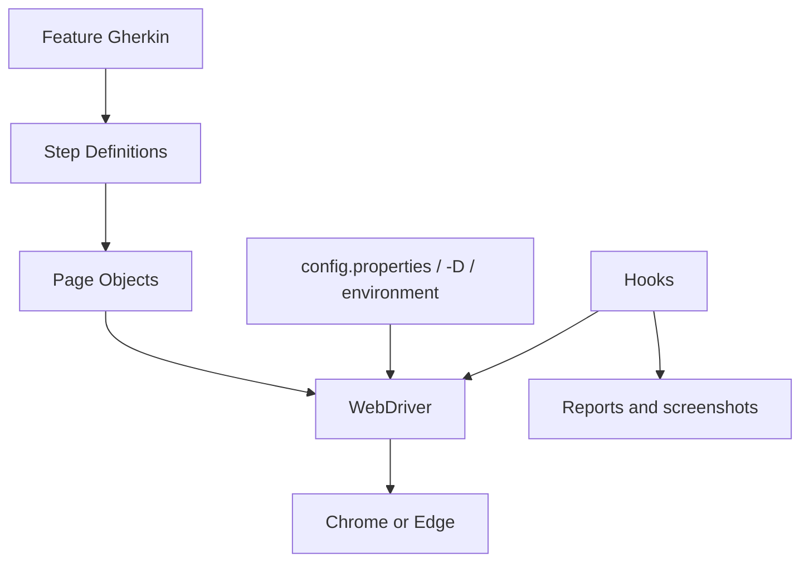

# Arquitectura del Template

**Baseline estable actual:** v1.0.1 (Hardening + CI/CD Readiness, Stable / Validated / Published) · **Hotfix documental en preparación:** v1.0.2

## Capas y responsabilidades

| Capa | Ubicación | Responsabilidad |
|---|---|---|
| Configuración | `src/main/java/com/automation/template/config`, `src/test/resources/config.properties` | Resuelve propiedades JVM, variables de entorno y valores base. |
| Driver | `src/main/java/com/automation/template/driver` | Crea Chrome/Edge y configura headless. |
| Pages | `src/main/java/com/automation/template/pages` | Encapsula locators, esperas e interacciones. |
| Support | `src/test/java/com/automation/template/support` | Conserva un WebDriver por hilo. |
| Hooks | `src/test/java/com/automation/template/hooks` | Inicia/cierra driver y captura evidencia. |
| Steps | `src/test/java/com/automation/template/steps` | Traduce Gherkin a intención. |
| Runner | `src/test/java/com/automation/template/runners` | Descubre Cucumber mediante JUnit Platform. |
| Features | `src/test/resources/features` | Especifica comportamiento en Gherkin. |
| Recursos | `src/test/resources` | Conserva configuración y recursos de prueba versionables. |

El Runner descubre features; Cucumber ejecuta `@Before`; `DriverManager` crea un driver por hilo; Steps invocan Pages; `@After` adjunta captura ante fallo y libera el navegador. Steps no contienen selectores, Pages no contienen aserciones de escenario y Hooks no contienen lógica de negocio. La configuración prioriza propiedades `-D`, variables de entorno y `config.properties`. `FrameworkLogger` escribe en consola y en `build/logs/automation.log`; las capturas sólo se persisten bajo `build/evidence/screenshots/` ante un fallo elegible.

Docker y Healenium no forman parte de la release v1.0.0 y, por tanto, no intervienen en este flujo.
