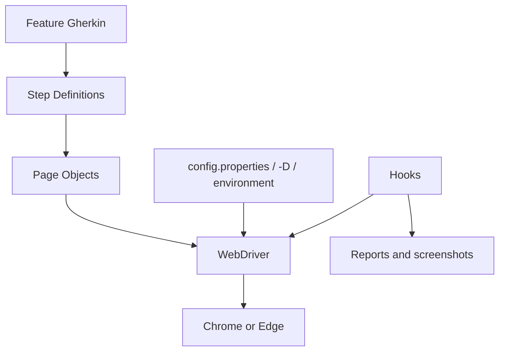

# Arquitectura del Template

**Versión estable publicada:** v1.1.0. **En desarrollo:** v1.2.0, Hito 4 — Bloque 1. Sin fecha de publicación de v1.2.0.

## Capas y responsabilidades

| Capa | Ubicación | Responsabilidad |
|---|---|---|
| Configuración | `src/main/java/com/automation/template/config`, `src/test/resources/config.properties` | Resuelve propiedades JVM, variables de entorno y valores base. |
| Driver | `src/main/java/com/automation/template/driver` | Crea Chrome/Edge y configura headless. |
| Logging | SLF4J en código; `src/test/resources/logback-test.xml` | Envía eventos a consola y `build/logs/automation.log` con Logback. |
| Pages | `src/main/java/com/automation/template/pages` | Encapsula locators, esperas e interacciones. |
| Support | `src/test/java/com/automation/template/support` | Conserva un WebDriver por hilo. |
| Hooks | `src/test/java/com/automation/template/hooks` | Inicia/cierra driver y captura evidencia. |
| Steps | `src/test/java/com/automation/template/steps` | Traduce Gherkin a intención. |
| Runner | `src/test/java/com/automation/template/runners` | Descubre Cucumber mediante JUnit Platform. |
| Features | `src/test/resources/features` | Especifica comportamiento en Gherkin. |
| Recursos | `src/test/resources` | Conserva configuración y recursos de prueba versionables. |

```mermaid
flowchart TD
  F[Feature Gherkin] --> S[Step Definitions]
  S --> P[Page Objects]
  P --> D[WebDriver]
  D --> B[Chrome or Edge]
  C[config.properties / -D / environment] --> D
  H[Hooks] --> D
  H --> R[Reports and screenshots]
```

El Runner descubre features; Cucumber ejecuta `@Before`; `DriverManager` crea un driver por hilo; Steps invocan Pages; `@After` adjunta captura ante fallo y libera el navegador. Steps no contienen selectores, Pages no contienen aserciones de escenario y Hooks no contienen lógica de negocio. La configuración prioriza propiedades `-D`, variables de entorno y `config.properties`. Los Hooks y el ciclo del driver usan SLF4J; Logback escribe en consola y en `build/logs/automation.log`. La [guía de logging](LOGGING.md) contiene los diagramas de arquitectura y flujo, los niveles y los datos registrados. Las capturas existentes sólo se persisten bajo `build/evidence/screenshots/` ante un fallo elegible.

Docker y Healenium no forman parte de la release v1.0.0 y, por tanto, no intervienen en este flujo.
