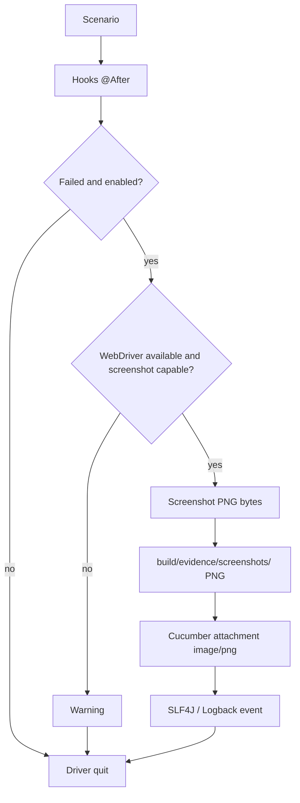

# Evidencias ante fallos / Failure evidence

**Estado / Status:** v1.1.0 Stable / Validated / Published (1 de octubre de 2026 / October 1, 2026); Hito 3 / Milestone 3 Completed / Validated. v1.2.0 In Development / En desarrollo, not published / no publicada, without a publication date / sin fecha de publicación. Hito 4 / Milestone 4 In Development; Bloque 1 / Block 1 and Bloque 2 / Block 2 Completed / Validated. Later blocks / bloques posteriores pending / pendientes. Este documento corresponde al Hito 4 — Bloque 2 / This document covers Milestone 4 — Block 2.

## Español

Al fallar un escenario Cucumber, el Hook `@After` registra el fallo y, si `screenshotOnFailure=true`, entrega el WebDriver actual a `EvidenceManager` antes de cerrarlo. El gestor comprueba que exista una sesión activa para `RemoteWebDriver` y que implemente `TakesScreenshot`, captura bytes PNG, guarda el archivo y lo adjunta al escenario mediante `Scenario.attach(image, "image/png", "failure-screenshot")`. La captura no se ejecuta para escenarios exitosos. Si falta el driver, está cerrado o falla la captura, se registra un warning y el fallo original del escenario se conserva. Si falla el guardado, todavía se intenta adjuntar la imagen.

Los archivos están en `build/evidence/screenshots/`, fuera de `src` y excluidos por `.gitignore` mediante `build/`. El nombre usa hasta 80 caracteres ASCII seguros del escenario, fecha/hora con milisegundos y UUID: `Login_admin_20261007_023015_123_<uuid>.png`. Caracteres especiales se sustituyen y un nombre vacío usa `failed_scenario`. Los logs de captura, ruta y attachment van a `build/logs/automation.log`; no contienen bytes ni Base64. Revise el contenido de la captura antes de compartirla, ya que la página podría mostrar datos sensibles.

Para validar manualmente, ejecute `./gradlew.bat clean test -Dheadless=true`, confirme que no exista `build/evidence/screenshots/`, cambie temporalmente la aserción del escenario local para provocar un fallo y ejecute de nuevo. Compruebe PNG, attachment en `build/reports/cucumber/cucumber.html` y los eventos del log. Restaure la aserción inmediatamente y repita la suite; el resultado final debe ser `BUILD SUCCESSFUL`. Puede usar `-Dheadless=false`; las capturas no dependen del modo. Mantenga `screenshotOnFailure=true` en proyectos derivados y no incluya evidencias generadas en Git.

## English

On a failed Cucumber scenario, the `@After` Hook logs the failure and, when `screenshotOnFailure=true`, passes the current WebDriver to `EvidenceManager` before quitting it. The manager checks for an active `RemoteWebDriver` session and `TakesScreenshot`, captures PNG bytes, saves the file, and calls `Scenario.attach(..., "image/png", "failure-screenshot")`. Passing scenarios produce no failure screenshot. Missing or closed drivers and capture failures produce warnings without replacing the scenario failure. If file storage fails, attachment is still attempted.

Files live under `build/evidence/screenshots/`, outside `src`, and are ignored by Git through `build/`. Filenames combine a sanitized, bounded scenario name, timestamp with milliseconds, and UUID. Capture, path and attachment events use SLF4J/Logback in `build/logs/automation.log`; binary and Base64 content are never logged. Review screenshots before sharing because page content may be sensitive.

To validate manually, run `./gradlew.bat clean test -Dheadless=true` and verify that the screenshot directory is absent. Temporarily make the local fixture assertion fail, rerun, and inspect the PNG, Cucumber HTML attachment and log. Restore the assertion immediately and rerun the full suite to `BUILD SUCCESSFUL`. The same flow works with `-Dheadless=false`. Keep runtime evidence out of Git.
