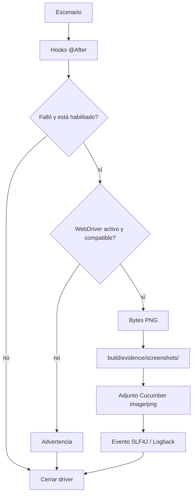

# Evidencias ante fallos

[English](../docs_en/EVIDENCE.md) · [Índice](README.md)

**Última versión publicada:** v1.2.0 (8 de octubre de 2026). Stable / Validated / Published.

Al fallar un escenario Cucumber, el Hook `@After` registra el fallo y, si `screenshotOnFailure=true`, entrega el WebDriver actual a `EvidenceManager` antes de cerrarlo. El gestor comprueba que exista una sesión activa para `RemoteWebDriver` y que implemente `TakesScreenshot`, captura bytes PNG, guarda el archivo y lo adjunta al escenario mediante `Scenario.attach(image, "image/png", "failure-screenshot")`. La captura no se ejecuta para escenarios exitosos. Si falta el driver, está cerrado o falla la captura, se registra un warning y el fallo original del escenario se conserva. Si falla el guardado, todavía se intenta adjuntar la imagen.

Los archivos están en `build/evidence/screenshots/`, fuera de `src` y excluidos por `.gitignore` mediante `build/`. El nombre usa hasta 80 caracteres ASCII seguros del escenario, fecha/hora con milisegundos y UUID: `Login_admin_20261007_023015_123_<uuid>.png`. Caracteres especiales se sustituyen y un nombre vacío usa `failed_scenario`. Los logs de captura, ruta y attachment van a `build/logs/automation.log`; no contienen bytes ni Base64. Revise el contenido de la captura antes de compartirla, ya que la página podría mostrar datos sensibles.

Para validar manualmente, ejecute `./gradlew.bat clean test -Dheadless=true`, confirme que no exista `build/evidence/screenshots/`, cambie temporalmente la aserción del escenario local para provocar un fallo y ejecute de nuevo. Compruebe PNG, attachment en `build/reports/cucumber/cucumber.html` y `build/reports/cucumber/cucumber.json` y los eventos del log. Restaure la aserción inmediatamente y repita la suite; el resultado final debe ser `BUILD SUCCESSFUL`. Puede usar `-Dheadless=false`; las capturas no dependen del modo. Mantenga `screenshotOnFailure=true` en proyectos derivados y no incluya evidencias generadas en Git.

Consulte el [contrato de reportes](REPORTING.md).
