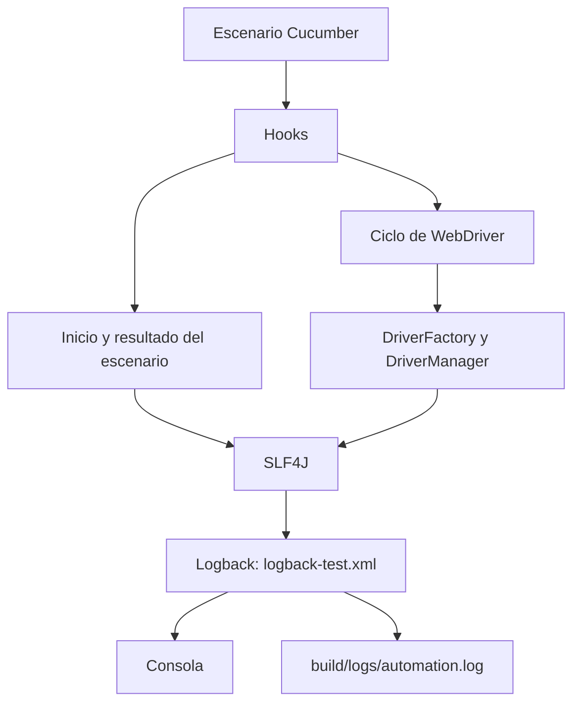
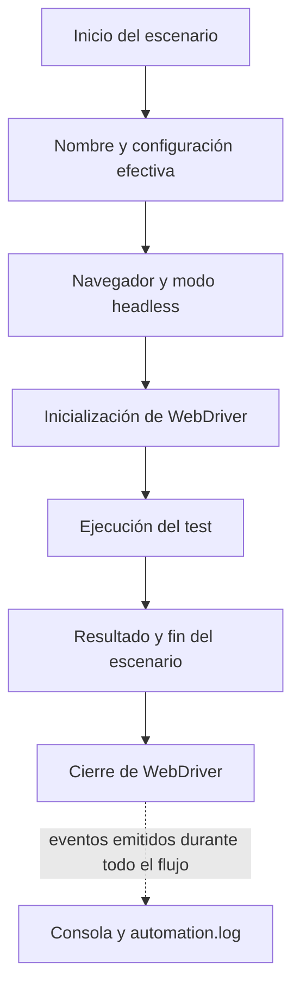

# Logging y observabilidad básica

**Última versión publicada:** v1.2.0 (8 de octubre de 2026). Estado: Stable / Validated / Published.

## Propósito y arquitectura

El logging permite reconstruir qué ocurrió en cada escenario y en el WebDriver cuando una prueba falla o se ejecuta en CI/CD. El código usa la fachada SLF4J 2.0.20 para que Hooks y driver dependan de una API común, sin configurar la salida en cada clase. Logback 1.6.5 es el proveedor de SLF4J durante las pruebas: centraliza niveles, formato y destinos en `src/test/resources/logback-test.xml`, sin configuración programática ni cambios en los Page Objects o Step Definitions.

Logback escribe simultáneamente en consola y en `build/logs/automation.log`. Gradle muestra la salida de los tests en la consola, y el workflow existente incluye `build/logs/` en el artifact `test-evidence`. Los archivos generados bajo `build/` están ignorados por Git y `clean` los elimina. El runner genera Cucumber HTML y JSON; Gradle conserva sus reportes HTML y JUnit XML.

## Diagrama A — Arquitectura de logging



## Diagrama B — Flujo de observabilidad



## Ciclo de logging

1. `@Before` registra el inicio y nombre del escenario, navegador y modo headless efectivos, obtenidos de `TestConfiguration`.
2. `DriverFactory` crea el navegador; registra detalles de creación en DEBUG y la inicialización completada en INFO.
3. `@After` registra nombre y estado final que devuelve Cucumber. `DriverManager` registra el cierre del WebDriver.
4. En un fallo, `EvidenceManager` registra intento de captura, ruta PNG, attachment o warning controlado antes del cierre. Consulte [Evidencias](EVIDENCE.md).

La `baseUrl` no se registra: la configuración permite una URL arbitraria que podría contener credenciales o parámetros sensibles. Tampoco se deben registrar secretos, tokens, contraseñas, cookies, headers confidenciales ni propiedades de configuración indiscriminadamente. Las rutas de error existentes registran excepciones completas para diagnóstico; algunas excepciones externas podrían incluir datos de la aplicación. Revise esas trazas antes de compartir logs o artifacts y evite añadir mensajes que incluyan datos sensibles.

## Niveles

| Nivel | Uso |
|---|---|
| DEBUG | Detalles técnicos para diagnosticar la creación del driver. Oculto por defecto. |
| INFO | Inicio y resultado del escenario, configuración segura y ciclo normal del driver. |
| WARN | Condición inesperada recuperable, por ejemplo ausencia de soporte para capturas. |
| ERROR | Error al cerrar el driver o manejar evidencia de un fallo. |

El nivel raíz predeterminado es INFO. Para diagnosticar las clases del framework, añada temporalmente `<logger name="com.automation.template" level="DEBUG"/>` dentro de `logback-test.xml` y restaure INFO antes de compartir la configuración. Evite activar DEBUG globalmente: Selenium y otras bibliotecas generan mucho ruido.

## Ejecución y ejemplo

En Windows: `.\gradlew.bat clean test -Dheadless=true`. En Linux y en GitHub Actions: `./gradlew clean test -Dheadless=true`.

Ejemplo de una ejecución local headless:

```text
2026-10-01 17:32:41.529 INFO  [Test worker] com.automation.template.hooks.Hooks - Starting scenario: Validar el encabezado de la página de ejemplo
2026-10-01 17:32:41.539 INFO  [Test worker] com.automation.template.hooks.Hooks - Scenario configuration: browser=CHROME, headless=true
2026-10-01 17:32:43.902 INFO  [Test worker] com.automation.template.hooks.Hooks - Finished scenario: Validar el encabezado de la página de ejemplo, status=PASSED
2026-10-01 17:32:43.996 INFO  [Test worker] c.a.template.support.DriverManager - WebDriver closed.
```

El timestamp y nombre del hilo cambian en cada ejecución; Logback puede abreviar nombres largos de clase por el ancho definido en el patrón.

## Troubleshooting

- Si no hay archivo, confirme que la tarea `test` haya llegado a iniciar el proceso de pruebas y revise `build/logs/automation.log` después del build. `clean` elimina el log anterior.
- Si no aparecen mensajes DEBUG, compruebe el nivel de `com.automation.template` en `logback-test.xml`.
- Si SLF4J advierte sobre proveedores múltiples o ausentes, ejecute `.\gradlew.bat dependencies --configuration testRuntimeClasspath` y revise que `logback-classic` sea el único proveedor.
- Si falla la descarga de dependencias por certificado `PKIX`, revise el almacén de confianza del JDK, el proxy y los certificados del sistema; no desactive la validación TLS.
- Si el smoke test falla, consulte el estado Cucumber, el log y los reportes existentes en `build/reports/`. La captura por fallo, si se produce, permanece bajo `build/evidence/screenshots/`.

## Alcance y relación con otras salidas

SLF4J y Logback registran los eventos de ejecución. `EvidenceManager` registra los intentos de captura, la ruta del PNG, el attachment y los fallos controlados. Los reportes Cucumber HTML/JSON y el artifact `test-evidence` permiten consultar el resultado funcional junto con esos eventos; véase [Reporting](REPORTING.md).
