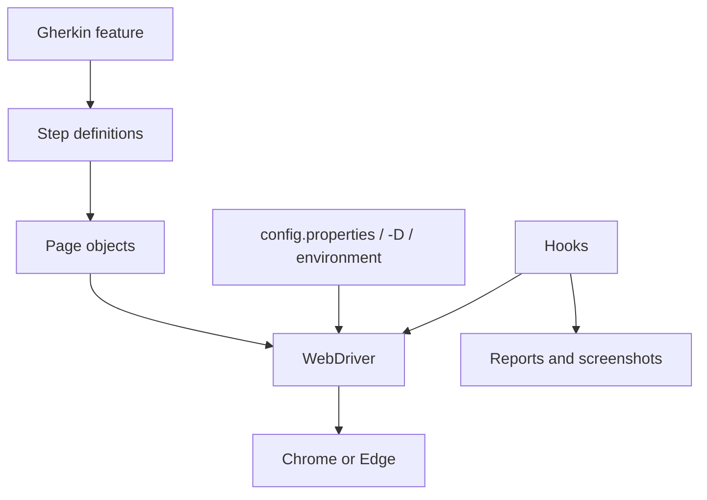

# Template architecture

[Español](../docs/ARCHITECTURE.md) · [English index](README.md)

**Latest published release:** v1.2.0 (October 8, 2026). Stable / Validated / Published.

## Layers and responsibilities

| Layer | Location | Responsibility |
|---|---|---|
| Configuration | `src/main/java/com/automation/template/config`, `src/test/resources/config.properties` | Resolves JVM properties, environment variables, and file defaults. |
| Driver | `src/main/java/com/automation/template/driver` | Creates Chrome or Edge with optional headless mode. |
| Pages | `src/main/java/com/automation/template/pages` | Encapsulates locators, waits, and interactions. |
| Support | `src/test/java/com/automation/template/support` | Holds one WebDriver per thread and manages failure evidence. |
| Hooks | `src/test/java/com/automation/template/hooks` | Starts and closes the driver; captures evidence before shutdown. |
| Steps | `src/test/java/com/automation/template/steps` | Maps Gherkin steps to page actions and assertions. |
| Runner | `src/test/java/com/automation/template/runners` | Discovers Cucumber on JUnit Platform. |
| Features and resources | `src/test/resources` | Stores Gherkin, the local fixture, and configuration. |
| Logging | SLF4J in Java; `src/test/resources/logback-test.xml` | Sends events to console and `build/logs/automation.log`. |

JUnit Platform discovers the runner; Cucumber calls `@Before`; `DriverManager` creates a driver per thread; steps call pages; `@After` records eligible failure evidence before closing the browser. Steps hold no locators, pages hold no scenario assertions, and hooks hold no business logic. Configuration precedence is JVM `-D`, environment, then `config.properties`. See [logging](LOGGING.md), [evidence](EVIDENCE.md), and [reporting](REPORTING.md). Docker, Grid, and Healenium are not implemented.
