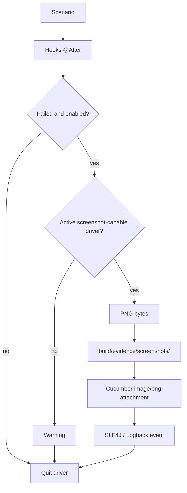

# Failure evidence

[Español](../docs/EVIDENCE.md) · [English index](README.md)

**Latest published release:** v1.2.0 (October 8, 2026). Stable / Validated / Published.

On a failed Cucumber scenario, the `@After` hook calls `EvidenceManager` before quitting WebDriver if `screenshotOnFailure=true`. The manager requires an active `RemoteWebDriver` session and `TakesScreenshot`, saves PNG bytes, and calls `Scenario.attach(..., "image/png", "failure-screenshot")`. Passing scenarios produce no failure screenshot. Missing or closed drivers and capture failures generate warnings without replacing the original failure; attachment is still attempted if file storage fails.

Files are under `build/evidence/screenshots/`, outside `src` and ignored by Git. Names combine up to 80 safe ASCII characters from the scenario, a millisecond timestamp, and a UUID. An empty sanitized name becomes `failed_scenario`. Logs record capture, file path, and attachment events without image bytes or Base64. Review image contents before sharing.

To verify manually, run `.\gradlew.bat clean test -Dheadless=true`, confirm the screenshot directory is absent, temporarily force the local fixture assertion to fail, and rerun. Inspect the PNG, Cucumber [HTML/JSON](REPORTING.md), and log. Restore the assertion immediately and rerun the suite to a successful result. Visible execution works the same way.
