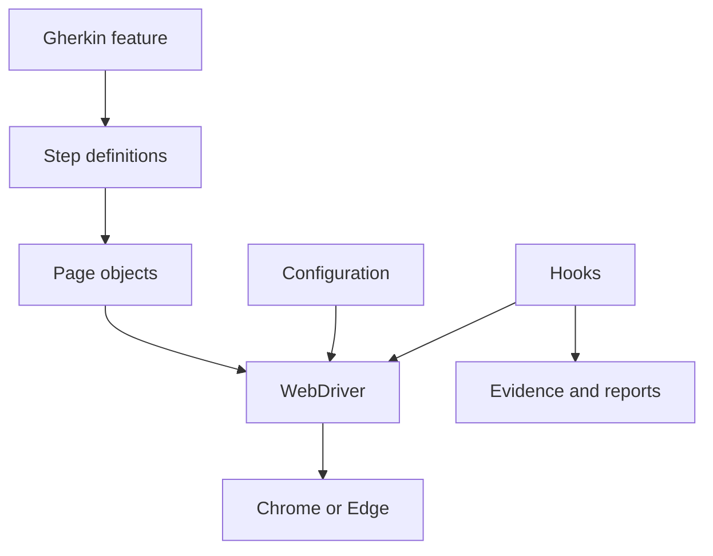
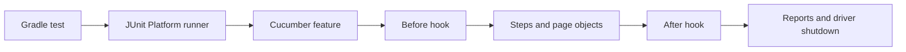
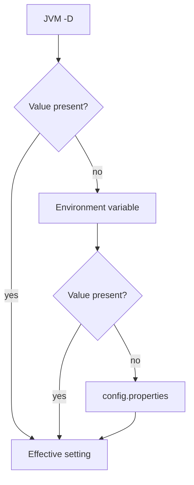
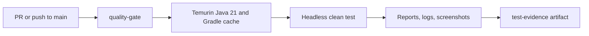

# Selenium Java Cucumber automation template — user guide

[Español](../docs/GUIA_USO_TEMPLATE_AUTOMATIZACION.md) · [English index](README.md)

## Contents

1. [Introduction and release](#introduction-and-release)
2. [Architecture](#architecture)
3. [Technology and prerequisites](#technology-and-prerequisites)
4. [Java version selection](#java-version-selection)
5. [First run](#first-run)
6. [Configuration and commands](#configuration-and-commands)
7. [First automation and reuse](#first-automation-and-reuse)
8. [CI/CD and quality gate](#cicd-and-quality-gate)
9. [Reports, evidence, and observability](#reports-evidence-and-observability)
10. [Troubleshooting and glossary](#troubleshooting-and-glossary)

## Introduction and release

This template provides a reusable Web UI test foundation: Java, Selenium WebDriver, Cucumber/Gherkin, JUnit Platform, Gradle Wrapper, and Page Object Model. Its neutral smoke test opens `src/test/resources/fixtures/example_page.html` and checks the Example Domain heading. The fixture is local; `baseUrl` remains available when adapting the template to an application.

**Current release:** [v1.2.0](https://github.com/IsraelBaz-coder/selenium-java-cucumber-automation-template/releases/tag/v1.2.0), published October 8, 2026 at 06:19:01 UTC; **Stable / Validated / Published**. Earlier published versions are v1.1.0 (October 1, 2026), v1.0.2 (September 26, 2026), v1.0.1 (September 25, 2026), and v1.0.0 (September 18, 2026); these are UTC publication dates. See the [changelog](../CHANGELOG.md) for preserved historical changes and the [Milestone 4 audit](HITO4_RELEASE_AUDIT.md) for prepublication evidence.

## Architecture







Configuration and driver/pages are under `src/main/java/com/automation/template`; hooks, runner, steps, and support are under `src/test/java/com/automation/template`. Gherkin and the fixture are in `src/test/resources`. Keep locators and UI interactions in page objects, scenario assertions in steps, and setup/cleanup in hooks. A `ThreadLocal` in `DriverManager` holds the scenario driver. [Architecture details](ARCHITECTURE.md) describe each layer.

## Technology and prerequisites

| Component | Version | Role |
|---|---|---|
| Java | 21 default; 17 supported | Build and test toolchain. |
| Gradle Wrapper | 8.14.5 | Reproducible build. |
| Selenium Java | 4.48.0 | WebDriver browser control. |
| Cucumber Java/engine | 7.34.7 | Gherkin execution. |
| JUnit BOM | 5.13.4 | JUnit Platform suite. |
| SLF4J API / Logback Classic | 2.0.20 / 1.6.5 | Test logging. |

Install JDK 21 and Chrome or Edge. A global Gradle installation is unnecessary. Check `java -version`, `.\gradlew.bat --version`, and `git --version`. In VS Code, open the repository root with `code .`, install Java and Gradle support plus a Gherkin extension, and wait for Gradle import. Confirm that Java imports resolve and `example_domain.feature` is recognized.

## Java version selection

`build.gradle` accepts only `-PjavaVersion=17` or `-PjavaVersion=21`, with Java 21 as default. This is a Gradle property, not a JVM `-D` property. A compatible JDK/toolchain must be available. To use 17 in the current PowerShell session, set `$env:JAVA_HOME` to an installed JDK 17, add its `bin` to `$env:Path`, confirm `java -version`, then run `.\gradlew.bat clean test -PjavaVersion=17`. In VS Code, select the same runtime through “Java: Configure Java Runtime”. For Java 21, open a fresh shell or restore `JAVA_HOME`, then use `-PjavaVersion=21`. CI uses Java 21.

## First run

From the repository root in PowerShell:

```powershell
.\gradlew.bat clean test -Dheadless=true
.\gradlew.bat clean test -Dheadless=false
```

The second command needs a graphical desktop. On Linux/macOS, use `./gradlew`. After a successful run, open `build/reports/cucumber/cucumber.html`. `BUILD FAILED` means the run failed; keep the full error message before changing code. The local HTML fixture makes the scenario independent of a remote site, though first browser or dependency setup may require network access.

## Configuration and commands

JVM `-D` properties override environment variables, which override `src/test/resources/config.properties`. Gradle forwards only supported keys to the test process.

| Property | Environment | Default | Meaning |
|---|---|---|---|
| `browser` | `BROWSER` | `CHROME` | Chrome or Edge. |
| `headless` | `HEADLESS` | `false` | Hide browser window. |
| `baseUrl` | `BASE_URL` | `https://example.com/` | Application URL for derived tests. |
| `timeoutSeconds` | `TIMEOUT_SECONDS` | `15` | Explicit wait. |
| `screenshotOnFailure` | `SCREENSHOT_ON_FAILURE` | `true` | Failure PNG capture. |
| `cucumber.filter.tags` | — | — | Gherkin tag expression. |

Examples: `.\gradlew.bat clean test -Dbrowser=EDGE`; `.\gradlew.bat clean test -Dheadless=true "-Dcucumber.filter.tags=@example"`; `.\gradlew.bat cucumber` (alias for `test`). The sample uses the local fixture regardless of `baseUrl`.

## First automation and reuse

Create a `.feature` file under `src/test/resources/features`, add Java step definitions under `steps`, and place selectors, explicit waits, and UI actions in a page object under `pages`. Keep test data independent and add scenario assertions in steps. The included feature and `ExampleDomainPage` show the wiring. Adapt `baseUrl`, pages, steps, features, and data for the new application; do not commit credentials, tokens, generated `build/` output, or browser screenshots. Run the sample first, then your new tagged scenario, then the whole suite.

```gherkin
# language: en
Feature: Login
  Scenario: Successful login
    Given the user opens the login page
    When the user signs in with valid credentials
    Then the dashboard is displayed
```

Create `LoginPage.java` with private locators and methods such as `open()`, `login()`, and `isDashboardVisible()`. Create `LoginSteps.java` to obtain the driver through `DriverManager`, call the page, and assert the outcome with JUnit. Use `WebDriverWait` instead of `Thread.sleep`. In a derived repository, update `rootProject.name` and the Gradle group, set `baseUrl`, replace the sample only after its smoke test passes, and review CI for the target application.

## CI/CD and quality gate



`.github/workflows/ci.yml` runs on pull requests targeting `main` and pushes to `main`, uses the Gradle Wrapper on `ubuntu-latest`, and executes `./gradlew clean test -Dheadless=true`. A nonzero Gradle exit code fails `quality-gate`. The artifact upload uses `if: always()` and retains available `test-evidence` for 14 days; an empty screenshot path is expected on PASS. For a failing PR, open **Checks → quality-gate → Details**, identify the failed step, download the artifact from **Actions** if present, fix on the branch, and rerun. The repository's documented `main` ruleset requires a PR and passing check. No automated deployment, Docker, Grid, or CI secrets are implemented in this template.

To review a change in GitHub: create a focused branch, run the local headless suite, inspect `git status` and `git diff`, commit, and push. Open a pull request with `main` as base and your branch as compare. Each pushed commit reruns the workflow. In the PR, inspect **Checks**; in **Actions**, inspect the workflow run, `quality-gate` job, individual steps, and the artifact. A failed or pending required check blocks integration. Correct the branch, rerun locally, commit, push, and wait for a new result.

## Reports, evidence, and observability

| Output | Path |
|---|---|
| Cucumber HTML / JSON | `build/reports/cucumber/cucumber.html` / `cucumber.json` |
| Gradle HTML | `build/reports/tests/test/` |
| JUnit XML | `build/test-results/test/` |
| Logback | `build/logs/automation.log` |
| Eligible failure PNG | `build/evidence/screenshots/` |

The `@After` hook records an eligible failure screenshot and Cucumber `image/png` attachment before closing WebDriver. SLF4J/Logback record scenario/driver lifecycle and capture events. `clean` removes previous results; inspect evidence before rerunning and review sensitive data before sharing. See [reporting](REPORTING.md), [evidence](EVIDENCE.md), and [logging and diagrams](LOGGING.md).

## Troubleshooting and glossary

For Java, browser, feature discovery, tags, TLS/PKIX, CI, missing reports, logs, or screenshots, use [troubleshooting](TROUBLESHOOTING.md). `--offline` uses cached dependencies only and is diagnostic. The [Spanish guide](../docs/GUIA_USO_TEMPLATE_AUTOMATIZACION.md) contains an extended glossary; key terms are: **BDD** (behavior-driven development), **Gherkin** (feature language), **POM** (page object model), **WebDriver** (browser controller), **hook** (scenario setup/cleanup), **quality gate** (required CI check), and **artifact** (downloadable build output).

The PDF manuals are [English](Manual_Selenium_Java_Cucumber_Automation_Template.pdf) and [Spanish](../docs/Manual_Template_Automatizacion_Selenium_Java_Cucumber.pdf). Generate both with `python scripts/create_manual.py` from the repository root after installing ReportLab.
