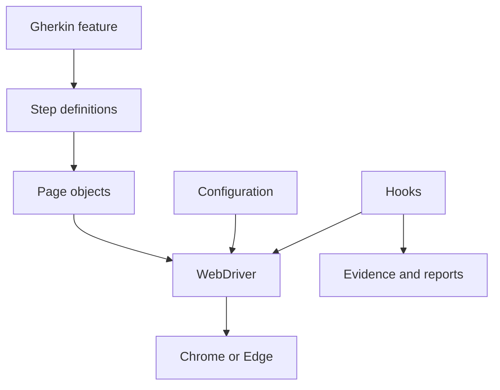
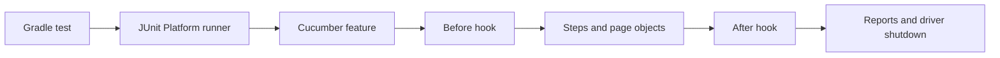
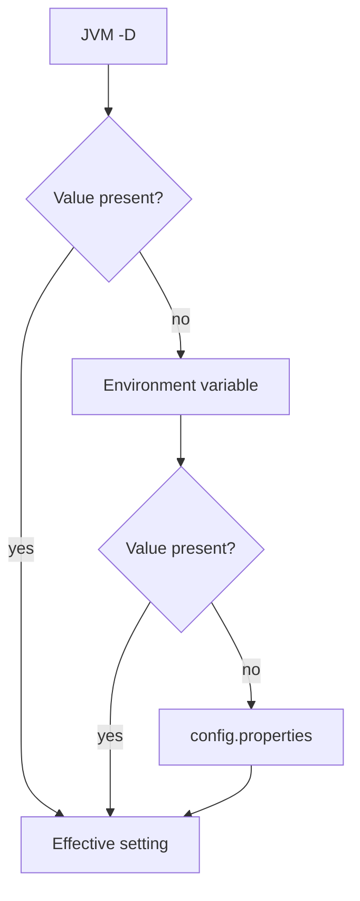
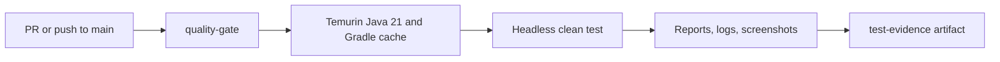

# Selenium Java Cucumber automation template — user guide

[Español](../docs/GUIA_USO_TEMPLATE_AUTOMATIZACION.md) · [English index](README.md)

<p align="center"><strong>Automation Template Selenium Java Cucumber</strong><br>Reusable Web UI automation template<br>v1.2.0 · Stable / Validated / Published · October 8, 2026<br>Latest published release: v1.2.0<br>Java 21 (default) / Java 17 (supported) · Selenium 4.48.0 · Cucumber 7.34.7 · JUnit 5.13.4 · Gradle 8.14.5</p>

## Contents

1. [Introduction and release](#introduction-and-release)
2. [Architecture](#architecture)
3. [Technology and prerequisites](#technology-and-prerequisites)
4. [Java version selection](#java-version-selection)
5. [First run](#first-run)
6. [Configuration and commands](#configuration-and-commands)
7. [Using Docker](#using-docker)
8. [First automation and reuse](#first-automation-and-reuse)
9. [CI/CD and quality gate](#cicd-and-quality-gate)
10. [Reports, evidence, and observability](#reports-evidence-and-observability)
11. [Troubleshooting and glossary](#troubleshooting-and-glossary)
12. [Detailed setup and reuse](#detailed-setup-and-reuse)
13. [CI review and main protection](#ci-review-and-main-protection)
14. [Full glossary and report generation](#full-glossary-and-report-generation)

## Introduction and release

This template provides a reusable Web UI test foundation: Java, Selenium WebDriver, Cucumber/Gherkin, JUnit Platform, Gradle Wrapper, and Page Object Model. Its neutral smoke test opens `src/test/resources/fixtures/example_page.html` and checks the Example Domain heading. The fixture is local; `baseUrl` remains available when adapting the template to an application.

**Current release:** [v1.2.0](https://github.com/IsraelBaz-coder/selenium-java-cucumber-automation-template/releases/tag/v1.2.0), published October 8, 2026 at 06:19:01 UTC; **Stable / Validated / Published**. Earlier published versions are v1.1.0 (October 1, 2026), v1.0.2 (September 26, 2026), v1.0.1 (September 25, 2026), and v1.0.0 (September 18, 2026); these are UTC publication dates. See the [changelog](../CHANGELOG.md) for preserved historical changes and the [Milestone 4 audit](HITO4_RELEASE_AUDIT.md) for prepublication evidence.

### Before you begin

Run all commands from the project root and replace example paths with your own. BUILD SUCCESSFUL means the Gradle run completed; keep the complete error and consult [Troubleshooting](TROUBLESHOOTING.md) on BUILD FAILED. After following this guide, you should be able to open the project in VS Code, run the sample, set an environment URL, and create a Feature, Page Object, and Steps.

### Document information

| Field | Value |
|---|---|
| Author / Template creator | Israel Baz |
| Role | Test Automation / Prompt Engineering / AI Automation |
| Maintainer | Israel Baz |

### Release history

Application-specific URL, browser, test data, and externally managed secrets belong in properties, environment variables, or JVM arguments. The v1.0.2 documentation-only hotfix corrected post-release status without changing functionality or dependencies. v1.2.0 remains the latest published stable release.

| Version | Date | Type and status | Main changes |
|---|---|---|---|
| v1.2.0 | October 8, 2026 | Stable / Validated / Published | SLF4J/Logback logging, automatic failure evidence, Cucumber HTML/JSON reporting. |
| v1.1.0 | October 1, 2026 | Stable / Validated / Published | Validated CI, evidence, Gradle cache, Quality Gate, Branch Protection, and operational documentation. |
| v1.0.2 | September 26, 2026 | Documentation-only Hotfix; Stable / Validated / Published | Corrected post-release status; this release did not add functionality, dependencies, CI/CD, Docker, Selenium Grid, Healenium, or Playwright. |
| v1.0.1 | September 25, 2026 | Hardening + CI/CD Readiness; Stable / Validated / Published | Logging, failure screenshots, tag propagation, artifact contract, and CI/CD guidance; no CI workflow in that release. |
| v1.0.0 | September 18, 2026 | First Stable Release; Stable / Validated / Published | Reusable Selenium/Cucumber/POM foundation, Wrapper, Chrome/Edge, headless and baseUrl configuration, example, bilingual documentation, troubleshooting, migration report, and regenerable manual. |

## Architecture







Configuration and driver/pages are under `src/main/java/com/automation/template`; hooks, runner, steps, and support are under `src/test/java/com/automation/template`. Gherkin and the fixture are in `src/test/resources`. Keep locators and UI interactions in page objects, scenario assertions in steps, and setup/cleanup in hooks. A `ThreadLocal` in `DriverManager` holds the scenario driver. [Architecture details](ARCHITECTURE.md) describe each layer.

## Technology and prerequisites

| Component | Version | Role |
|---|---|---|
| Java | 21 default; 17 supported | Build and test toolchain. |
| Gradle Wrapper | 8.14.5 | Reproducible build. |
| Selenium Java | 4.48.0 | WebDriver browser control. |
| Cucumber Java/engine | 7.34.7 | Gherkin execution. |
| JUnit BOM | 5.13.4 | JUnit Platform suite. |
| SLF4J API / Logback Classic | 2.0.20 / 1.6.5 | Test logging. |

Install JDK 21 and Chrome or Edge. A global Gradle installation is unnecessary. Check `java -version`, `.\gradlew.bat --version`, and `git --version`. In VS Code, open the repository root with `code .`, install Java and Gradle support plus a Gherkin extension, and wait for Gradle import. Confirm that Java imports resolve and `example_domain.feature` is recognized.

## Java version selection

`build.gradle` accepts only `-PjavaVersion=17` or `-PjavaVersion=21`, with Java 21 as default. This is a Gradle property, not a JVM `-D` property. A compatible JDK/toolchain must be available. To use 17 in the current PowerShell session, set `$env:JAVA_HOME` to an installed JDK 17, add its `bin` to `$env:Path`, confirm `java -version`, then run `.\gradlew.bat clean test -PjavaVersion=17`. In VS Code, select the same runtime through “Java: Configure Java Runtime”. For Java 21, open a fresh shell or restore `JAVA_HOME`, then use `-PjavaVersion=21`. CI uses Java 21.

## First run

From the repository root in PowerShell:

```powershell
.\gradlew.bat clean test -Dheadless=true
.\gradlew.bat clean test -Dheadless=false
```

The second command needs a graphical desktop. On Linux/macOS, use `./gradlew`. After a successful run, open `build/reports/cucumber/cucumber.html`. `BUILD FAILED` means the run failed; keep the full error message before changing code. The local HTML fixture makes the scenario independent of a remote site, though first browser or dependency setup may require network access.

## Configuration and commands

JVM `-D` properties override environment variables, which override `src/test/resources/config.properties`. Gradle forwards only supported keys to the test process.

| Property | Environment | Default | Meaning |
|---|---|---|---|
| `browser` | `BROWSER` | `CHROME` | Chrome or Edge. |
| `headless` | `HEADLESS` | `false` | Hide browser window. |
| `baseUrl` | `BASE_URL` | `https://example.com/` | Application URL for derived tests. |
| `timeoutSeconds` | `TIMEOUT_SECONDS` | `15` | Explicit wait. |
| `screenshotOnFailure` | `SCREENSHOT_ON_FAILURE` | `true` | Failure PNG capture. |
| `cucumber.filter.tags` | — | — | Gherkin tag expression. |

Examples: `.\gradlew.bat clean test -Dbrowser=EDGE`; `.\gradlew.bat clean test -Dheadless=true "-Dcucumber.filter.tags=@example"`; `.\gradlew.bat cucumber` (alias for `test`). The sample uses the local fixture regardless of `baseUrl`.

## Using Docker

Docker runs tests in a Linux container with Java 21, Chrome/ChromeDriver 155, and the existing Gradle Wrapper. On Windows you need Docker Desktop with WSL2 and its Linux engine running. Open PowerShell at the repository root, check `docker version` and `docker info`, then run:

~~~powershell
docker build --progress=plain -t selenium-java-cucumber-template:1.3.0-dev .
docker run --rm selenium-java-cucumber-template:1.3.0-dev java -version
docker run --rm selenium-java-cucumber-template:1.3.0-dev google-chrome --version
docker run --rm selenium-java-cucumber-template:1.3.0-dev chromedriver --version
docker run --rm selenium-java-cucumber-template:1.3.0-dev
~~~

Expect BUILD SUCCESSFUL and Example Domain PASSED. `--progress=plain` displays build steps, `-t` names the image, and `--rm` deletes the temporary container. A WARN does not itself mean failure: [TECH-001/002](TECHNICAL_DEBT.md) track the current CDP and Cucumber discovery warnings. Without a mount, `build/` disappears with the container; the [Docker guide](DOCKER.md) gives a verified bind mount for reports and covers permissions, daemon/WSL2, downloads, and TLS/PKIX. The initial build and run were reported by the user; Codex verified a mounted run. v1.2.0 remains the latest published release and Block 1 stays open.

## First automation and reuse

Create a `.feature` file under `src/test/resources/features`, add Java step definitions under `steps`, and place selectors, explicit waits, and UI actions in a page object under `pages`. Keep test data independent and add scenario assertions in steps. The included feature and `ExampleDomainPage` show the wiring. Adapt `baseUrl`, pages, steps, features, and data for the new application; do not commit credentials, tokens, generated `build/` output, or browser screenshots. Run the sample first, then your new tagged scenario, then the whole suite.

```gherkin
# language: en
Feature: Login
  Scenario: Successful login
    Given the user opens the login page
    When the user signs in with valid credentials
    Then the dashboard is displayed
```

Create `LoginPage.java` with private locators and methods such as `open()`, `login()`, and `isDashboardVisible()`. Create `LoginSteps.java` to obtain the driver through `DriverManager`, call the page, and assert the outcome with JUnit. Use `WebDriverWait` instead of `Thread.sleep`. In a derived repository, update `rootProject.name` and the Gradle group, set `baseUrl`, replace the sample only after its smoke test passes, and review CI for the target application.

## CI/CD and quality gate



`.github/workflows/ci.yml` runs on pull requests targeting `main` and pushes to `main`, uses the Gradle Wrapper on `ubuntu-latest`, and executes `./gradlew clean test -Dheadless=true`. A nonzero Gradle exit code fails `quality-gate`. The artifact upload uses `if: always()` and retains available `test-evidence` for 14 days; an empty screenshot path is expected on PASS. For a failing PR, open **Checks → quality-gate → Details**, identify the failed step, download the artifact from **Actions** if present, fix on the branch, and rerun. The repository's documented `main` ruleset requires a PR and passing check. The Docker image is separate from this workflow; automated deployment, Grid, and CI secrets are not implemented.

To review a change in GitHub: create a focused branch, run the local headless suite, inspect `git status` and `git diff`, commit, and push. Open a pull request with `main` as base and your branch as compare. Each pushed commit reruns the workflow. In the PR, inspect **Checks**; in **Actions**, inspect the workflow run, `quality-gate` job, individual steps, and the artifact. A failed or pending required check blocks integration. Correct the branch, rerun locally, commit, push, and wait for a new result.

## Reports, evidence, and observability

| Output | Path |
|---|---|
| Cucumber HTML / JSON | `build/reports/cucumber/cucumber.html` / `cucumber.json` |
| Gradle HTML | `build/reports/tests/test/` |
| JUnit XML | `build/test-results/test/` |
| Logback | `build/logs/automation.log` |
| Eligible failure PNG | `build/evidence/screenshots/` |

The `@After` hook records an eligible failure screenshot and Cucumber `image/png` attachment before closing WebDriver. SLF4J/Logback record scenario/driver lifecycle and capture events. `clean` removes previous results; inspect evidence before rerunning and review sensitive data before sharing. See [reporting](REPORTING.md), [evidence](EVIDENCE.md), and [logging and diagrams](LOGGING.md).

## Troubleshooting and glossary

For Java, browser, feature discovery, tags, TLS/PKIX, CI, missing reports, logs, or screenshots, use [troubleshooting](TROUBLESHOOTING.md). `--offline` uses cached dependencies only and is diagnostic. The full glossary below defines the terms used in both language guides.

The PDF manuals are [English](Manual_Selenium_Java_Cucumber_Automation_Template.pdf) and [Spanish](../docs/Manual_Template_Automatizacion_Selenium_Java_Cucumber.pdf). Generate both with `python scripts/create_manual.py` from the repository root after installing ReportLab.

## Detailed setup and reuse

### Check that VS Code is ready

1. In Explorer, confirm that src, gradle, build.gradle, and settings.gradle appear.
2. Open src/test/resources/features/example_domain.feature and check Gherkin syntax highlighting.
3. Open src/main/java/com/automation/template/pages/ExampleDomainPage.java and confirm that Java imports resolve.
4. Open **Terminal > New Terminal** and run `.\gradlew.bat test -Dheadless=true`.
5. Open build/reports/cucumber/cucumber.html after the run.

Wait for “Importing Gradle project” to finish. If prompted for a JDK, select Java 21 by default, or Java 17 when executing with -PjavaVersion=17. The project also uses GitLens when available; Features live in src/test/resources/features, Pages in src/main/java, and Steps/Hooks/Runner in src/test/java.

### Java 17 compatibility and toolchain

Java 21 is the default and recommended version. Java 17 is the only alternative. build.gradle explicitly rejects 18, 19, 20, 22, and all other values. Gradle itself needs JDK 17 or later, and the selected toolchain must be installed or resolvable.

| Need | PowerShell | Result |
|---|---|---|
| Default | `.\gradlew.bat test` | Java 21. |
| Java 17 | `.\gradlew.bat clean test -PjavaVersion=17` | Java 17. |
| Explicit Java 21 | `.\gradlew.bat clean test -PjavaVersion=21` | Java 21 for scripts or CI. |
| Unsupported version | `.\gradlew.bat clean test -PjavaVersion=18` | Build rejects it. |

To configure Java 17 in the current PowerShell session:

~~~powershell
$env:JAVA_HOME = 'C:\path\jdk-17'
$env:Path = "$env:JAVA_HOME\bin;$env:Path"
java -version
.\gradlew.bat clean test -PjavaVersion=17
~~~

Select the same JDK in VS Code with Ctrl+Shift+P → **Java: Configure Java Runtime**, then wait for Gradle import or reload if prompted. Confirm BUILD SUCCESSFUL and inspect build/reports/cucumber/cucumber.html; also run headless before submitting changes to CI. To return to Java 21, open a fresh shell or set JAVA_HOME to C:\path\jdk-21, update Path, choose JDK 21 in VS Code, and run `.\gradlew.bat clean test -PjavaVersion=21`. Do not store local JDK paths in Git. Validate local and CI execution before adopting Java 17 in a derived project; keep Java 21 as the baseline if a future dependency requires it.

### First-run checklist

From the project root, run `.\gradlew.bat test -Dheadless=true`, inspect build/reports/cucumber/cucumber.html, then run `.\gradlew.bat clean test` for a visible browser. The sample checks the local fixture's “Example Domain” heading, although initial dependencies or browser setup may require network access. During the first exercises, keep gradlew, gradle/wrapper, Hooks, Runner, and DriverFactory intact because they are shared components.

### Full command inventory

JVM -D values override environment variables; environment variables override src/test/resources/config.properties. The defaults are browser=CHROME, headless=false, baseUrl=https://example.com/, timeoutSeconds=15, and screenshotOnFailure=true. The sample's local fixture does not change with baseUrl.

| Purpose | Command |
|---|---|
| Clean | `.\gradlew.bat clean` |
| Run | `.\gradlew.bat test` |
| Clean and run | `.\gradlew.bat clean test` |
| Headless | `.\gradlew.bat clean test -Dheadless=true` |
| Chrome / Edge | `.\gradlew.bat clean test -Dbrowser=CHROME` / `-Dbrowser=EDGE` |
| Application URL | `.\gradlew.bat clean test -DbaseUrl=https://your-application` |
| Tag subset | `.\gradlew.bat clean test "-Dcucumber.filter.tags=@example"` |
| Headless tag subset | `.\gradlew.bat clean test -Dheadless=true "-Dcucumber.filter.tags=@example"` |
| Cucumber alias | `.\gradlew.bat cucumber` |
| Dependencies / Gradle version / Git status | `.\gradlew.bat dependencies` / `.\gradlew.bat --version` / `git status` |

Environment variables include BASE_URL, BROWSER, HEADLESS, TIMEOUT_SECONDS, and SCREENSHOT_ON_FAILURE. The HTML report is build/reports/cucumber/cucumber.html; eligible screenshots are under build/evidence/screenshots/ and the log is build/logs/automation.log.

### Minimal complete automation example

Keep each concern in its file:

| File | Include | Exclude |
|---|---|---|
| login.feature | A business-language flow. | XPath, CSS, or Java code. |
| LoginSteps.java | Page-method calls and assertions. | Selectors or Thread.sleep. |
| LoginPage.java | Selectors, waits, and screen actions. | Gherkin sentences or scenario rules. |

For a new screen, copy the structure of ExampleDomainPage, rename it, and replace its h1 locator with application locators. Prefer stable attributes intended for tests, such as data-testid. Configure baseUrl with -DbaseUrl=..., run headless, and inspect the HTML result.

Before asking for help, confirm the working directory, Java version, installed browser, manually reachable URL, .feature location, exact Step-to-annotation match, and absence of committed credentials, tokens, or sensitive internal URLs.

### Reuse sequence

1. Copy or clone the template and keep the original as a reference.
2. Change rootProject.name in settings.gradle and group in build.gradle to team-approved identifiers.
3. Set the environment with -DbaseUrl=https://your-application; keep sensitive URLs and credentials out of Git.
4. Open the URL manually and run a headless smoke test; resolve connectivity, JDK, or browser failures before adding scenarios.
5. Once the smoke works, replace example_domain.feature, ExampleDomainPage, and ExampleDomainSteps, or retain them temporarily as examples.
6. Add the first business Feature, Page Object, and Steps with the separation described above.
7. Add @smoke and @regression tags and select subsets with -Dcucumber.filter.tags.
8. For a new repository, initialize Git, configure its remote, review .gitignore and .github/workflows/ci.yml, create a branch, and open a PR. The included workflow runs headless tests and uploads available evidence.

The team should be able to clone, set a URL through an environment variable or -D, run a test, and open its report without editing shared framework code. Driver, configuration, Hooks, Runner, reporting, and conventions are generic; URL, data, Pages, Features, Steps, tags, and pipeline are customizable.

## CI review and main protection

### CI/CD execution contract

~~~mermaid
flowchart TD
  DEV[Developer] --> PUSH[Git Push / Pull Request]
  PUSH --> GHE[GitHub Enterprise]
  GHE --> CHECKOUT[Checkout]
  CHECKOUT --> JAVA[Java 21 Temurin]
  JAVA --> CACHE[Gradle Setup / Cache]
  CACHE --> WRAPPER[Gradle Wrapper]
  WRAPPER --> TEST[Headless automated tests]
  TEST --> REPORTS[Reports / Logs / Screenshots]
  REPORTS --> ART[test-evidence]
~~~

CI checks changes before integration. CD may mean continuous delivery or automatic deployment; this repository uses CI and does not deploy an application. A PR to main or a push to main starts .github/workflows/ci.yml on ubuntu-latest. It runs `./gradlew clean test -Dheadless=true`; on Windows use `.\gradlew.bat clean test "-Dheadless=true"`. Exit code 0 passes and any other code fails quality-gate. The contract supports CHROME/EDGE selection and cucumber.filter.tags. Docker is separate from this workflow.

After Temurin Java 21 setup, gradle/actions/setup-gradle@v6 prepares a basic cache. A hit may reuse dependencies and reduce preparation time; a miss causes Gradle to download what it needs. The Wrapper remains the execution method. Caching changes no Selenium, Cucumber, POM, Feature, Step, or local-fixture behavior.

### Run and inspect GitHub Actions step by step

You need Git, a repository connected to GitHub, and permission to push a branch. Run commands from the project root.

1. Create a separate branch with `git switch -c feature/my-change` (or `git switch feature/my-change` if it exists).
2. Edit the required Page Objects and tests.
3. Inspect `git status` and `git diff`; exclude credentials and generated files.
4. Run `.\gradlew.bat clean test "-Dheadless=true"` on Windows, or `./gradlew clean test -Dheadless=true` on Linux/macOS. Fix BUILD FAILED before continuing.
5. Commit with `git add path/to/file` and `git commit -m "Describe my change"`.
6. Push first with `git push -u origin feature/my-change`; later pushes use `git push`.
7. In GitHub, choose **Pull requests → New pull request**, main as base and your branch as compare. Review the diff, enter a title and description, and create the PR.
8. Wait for Actions. Each new pushed commit updates the PR and starts another run.
9. In the PR's **Checks** tab, open quality-gate → **Details**. Inspect checkout, Java setup, Gradle cache, tests, evidence upload, and the final result. Expand any failed step.
10. In **Actions → CI → run → quality-gate**, check branch, PR, commit, date, status, and duration. Success means completed, Failure means failed, In progress means still running, Cancelled means stopped, and Skipped means a conditional step did not run.

### Quality Gate failures and evidence

Quality Gate is the automatic check that must pass before a change is ready. The stable check is quality-gate. Gradle returns 0 when compilation and tests pass and a nonzero code otherwise. Artifact upload cannot turn FAIL into PASS.

If quality-gate fails, open PR → **Checks → quality-gate → Details**, expand the failed step, read the error, download test-evidence if present, and compare reports, XML, automation.log, and screenshots. Some files may be absent if Gradle stopped early. Fix the branch, rerun the local headless command, inspect the diff, commit, push, and wait for the new check.

| Local path | Content |
|---|---|
| `build/reports/cucumber/cucumber.html` | Cucumber scenarios and functional steps. |
| `build/reports/cucumber/cucumber.json` | Structured results and attachments. |
| `build/reports/tests/test/` | Gradle/JUnit HTML report. |
| `build/test-results/test/` | Structured XML results. |
| `build/logs/automation.log` | Execution log. |
| `build/evidence/screenshots/` | Eligible failure captures. |

An artifact is a downloadable file separate from source code. Open **Repository → Actions → CI → PR run → Artifacts → test-evidence**, then download and extract the ZIP. The workflow attempts upload on PASS and FAIL and retains available evidence for 14 days. A screenshot directory may be absent on PASS; an artifact may be absent if Gradle produced no files. Check **Upload test evidence** in that case.

### Branch protection and validated example

Branch Protection limits integration into main. The documented ruleset requires a PR, a passing quality-gate status check, and an up-to-date branch. It blocks force pushes and restricts deletion of main. An administrator can inspect **Repository → Settings → Rules → Rulesets**, subject to permissions. The workflow does not create this administrative rule. The expected path is **feature branch → PR → quality-gate → code review → merge**; a required check blocks merge while failing or pending.

Ana creates feature/page-change, edits a Page Object, tests locally, commits, pushes, and opens a PR. Actions starts quality-gate. On Success, a reviewer may merge once all rules are met. On Failure, she reads Details and test-evidence, fixes the branch, reruns tests, commits, and pushes; the PR and check update.

The v1.1.0 CI validation recorded **initial PASS → controlled FAIL → quality-gate blocking merge → test-evidence available → restoration → PASS → merge → post-merge PASS on main**. Evidence was available in PASS and FAIL; the controlled failure was not left on main. v1.1.0 was published October 1, 2026, and v1.2.0 has been Stable / Validated / Published since October 8, 2026.

## Full glossary and report generation

### Regenerating the PDF manuals

The script scripts/create_manual.py needs Python 3 and ReportLab. Run `python scripts/create_manual.py` from the repository root. It writes docs/Manual_Template_Automatizacion_Selenium_Java_Cucumber.pdf and docs_en/Manual_Selenium_Java_Cucumber_Automation_Template.pdf. Its --output option writes only the Spanish manual to a specified path for temporary validation. Inspect both PDFs visually before distribution. The Git-ignored work/ folder contains temporary generation and validation files, is not part of the framework, and may be removed. The manuals use neutral branding.

### Good practices

Start troubleshooting with JDK 21, the Wrapper run from the root, browser installation, Maven Central access, reachable URL, and exact Gherkin-to-Step matching. Use [Troubleshooting](TROUBLESHOOTING.md) for detailed cases.

- Use one Page Object per screen or component, private locators, and descriptive names.
- Keep configuration external and secrets in the environment or a secret store.
- Use explicit waits and stable test attributes for locators.
- Keep test data isolated; use screenshots/logs as evidence and write clear assertions.
- Prefer small commits, branches, PRs, code review, and deliberate dependency updates.

### Glossary

| Term | Definition |
|---|---|
| Automation Testing | Executing tests through software. |
| Selenium / WebDriver | Library and API that control a browser. |
| Cucumber / BDD / Gherkin | Tool, approach, and language for behavior descriptions. |
| Feature / Scenario | Business capability and a concrete Gherkin case. |
| Step Definition | Java code that implements a Gherkin sentence. |
| Page Object Model | Pattern that encapsulates UI interactions in objects. |
| Hooks / Runner | Scenario lifecycle code and test entry point. |
| Gradle / Gradle Wrapper | Build tool and versioned launcher. |
| JUnit / Headless | Test platform and browser operation without a window. |
| CI/CD / Pipeline | Continuous integration/delivery and its sequence. |
| Git / GitHub Enterprise | Version control and corporate hosting platform. |
| Locator / XPath / CSS Selector | Strategies for finding UI elements. |
| Assertions / Test Data | Expected-result checks and controlled inputs. |
| Environment Variable | External process configuration value. |
| CI | Continuous integration: automated checks for proposed changes. |
| CD | Continuous delivery or deployment; this template does not deploy automatically. |
| GitHub Actions | GitHub service that runs workflows. |
| Workflow | Automated instruction file such as ci.yml. |
| Pipeline | Sequence of automated checks. |
| Job | Group of steps executed on a runner. |
| Step | Individual job instruction. |
| Runner / ubuntu-latest | Temporary machine; ubuntu-latest specifies Ubuntu Linux. |
| Pull Request | Proposal to integrate a branch after review. |
| Branch / Feature Branch | Separate line of work for a focused change. |
| main | Shared primary branch. |
| Quality Gate | Check that must pass before a change is ready. |
| Status Check / Required Status Check | Job result; a required check blocks merge when failing. |
| Branch Protection | Rules guarding a branch against improper integration. |
| Artifact | Downloadable file from an Actions run. |
| Log / Report | Event record / readable result summary. |
| Exit Code | Process result: 0 success, nonzero failure. |
| PASS / FAIL | Successful / failed verification. |
| Commit / Push / Merge | Save a snapshot / send it to GitHub / join branches. |
| Checkout | Retrieve a code revision on a runner. |

### Generating and inspecting reports

The runner generates `build/reports/cucumber/cucumber.html` and `build/reports/cucumber/cucumber.json`; both outputs have been validated. Gradle produces `build/reports/tests/test/` and `build/test-results/test/`; Logback writes `build/logs/automation.log`; EvidenceManager saves eligible failure PNGs under `build/evidence/screenshots/`. GitHub Actions includes the entire `build/reports/cucumber/` directory in test-evidence with `if: always()`, including the JSON output. These regenerable build/ artifacts are ignored by Git. See [Reporting](REPORTING.md) for local use, CI, and diagnosis.
