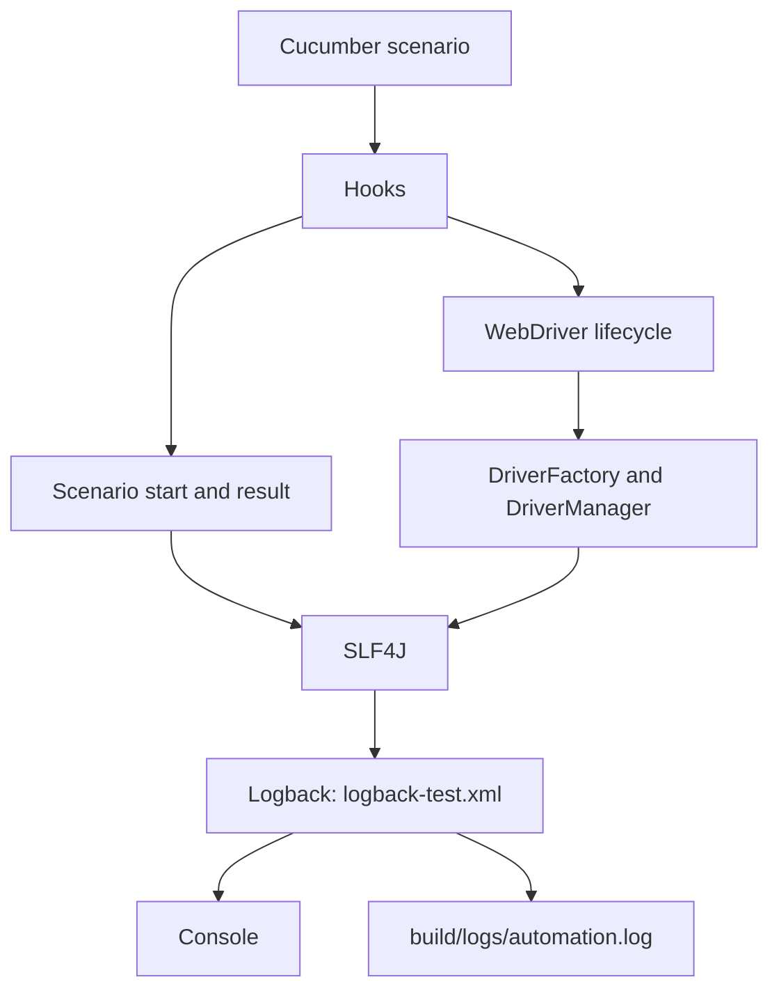
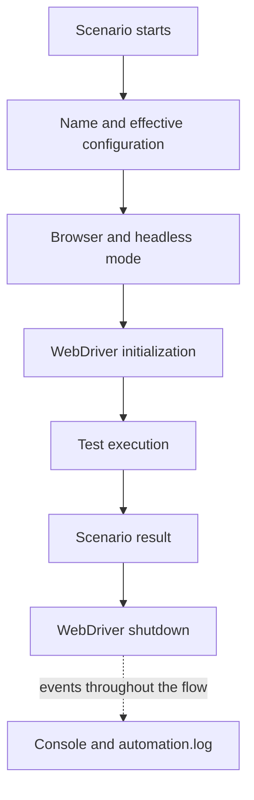

# Logging and observability

[Español](../docs/LOGGING.md) · [English index](README.md)

**Latest published release:** v1.2.0 (October 8, 2026). Stable / Validated / Published.

## Purpose and architecture

SLF4J 2.0.20 is the logging API in the hooks and driver lifecycle. Logback 1.6.5 supplies the test runtime implementation through `src/test/resources/logback-test.xml`. It writes INFO and higher to the console and `build/logs/automation.log`. Gradle displays test output; CI uploads available logs in `test-evidence`. `clean` removes logs along with other generated files.

## Diagram A — logging architecture

## Diagram B — observability flow

## Events and levels

The `@Before` hook logs scenario name, browser, and headless mode. `DriverFactory` logs successful initialization; `@After` logs final status, `EvidenceManager` logs capture and attachment attempts on eligible failures, and `DriverManager` logs shutdown.

| Level | Use |
|---|---|
| DEBUG | Driver creation detail, hidden by default. |
| INFO | Normal scenario and driver lifecycle. |
| WARN | Recoverable capture problems. |
| ERROR | Driver shutdown or evidence handling errors. |

The root level is INFO. For framework diagnostics, temporarily add `<logger name="com.automation.template" level="DEBUG"/>` to `logback-test.xml`. Do not log `baseUrl`, tokens, passwords, cookies, authorization headers, or screenshot bytes. Third party exception traces can still contain application data; review logs before sharing.

Run `.\gradlew.bat clean test -Dheadless=true` on Windows or `./gradlew clean test -Dheadless=true` on Linux/macOS. If the file is absent, verify that `test` started; for missing DEBUG messages, inspect the logger level. For provider conflicts inspect `testRuntimeClasspath`. For PKIX errors inspect the JDK trust store and proxy without disabling TLS. See [troubleshooting](TROUBLESHOOTING.md) and [reporting](REPORTING.md).
